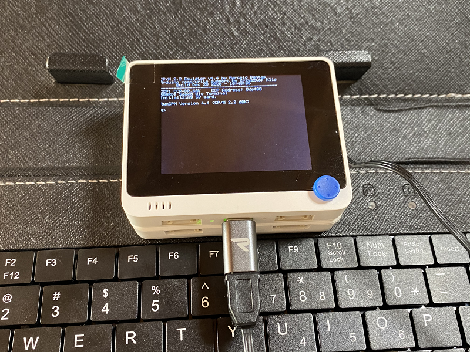
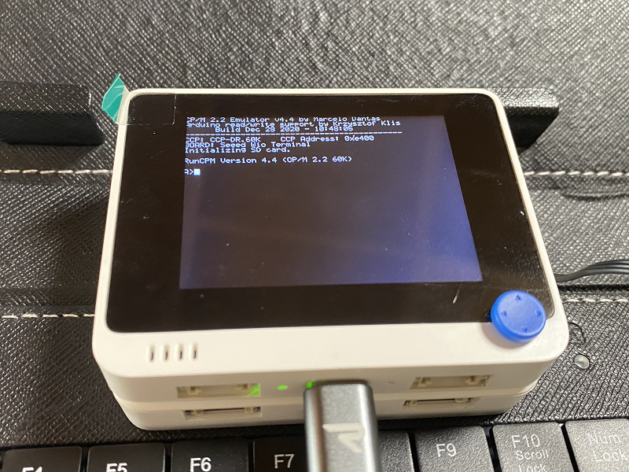

# Wio_RunCPM_vt100_UsbKB
Wio Terminalで動く超小型CP/Mマシン

  
  

"VT100 Terminal Emulator"と"Z80 CP/M 2.2 emulator"を組み合わせた、Wio Terminalで動く超小型CP/Mマシンです。 
(注意：ディスプレイが1行53文字なので、1行80文字を前提にしているプログラムは表示が崩れます。但し、極小フォントを使って1行80文字のモードに切り替える事は可能です。)  
ベースにしたオリジナルはこちら。 
VT100 Terminal Emulator for Wio Terminal <https://github.com/ht-deko/vt100_wt> 
RunCPM - Z80 CP/M 2.2 emulator <https://github.com/MockbaTheBorg/RunCPM> 

---

### 必要な物 ###
* [Wio Terminal](https://www.switch-science.com/catalog/6360/ "Title") 
* [Wio Terminal 用バッテリーベース](https://www.switch-science.com/catalog/6816/ "Title") 
* Arduino IDE (1.8.13で動作確認をしました。) 
* [SAMD51 Interrupt Timer library](https://github.com/Dennis-van-Gils/SAMD51_InterruptTimer "Title")
* [SDdFatライブラリ](https://github.com/greiman/SdFat "Title") (2.0.4で動作確認をしました。)
* [LovyanGFXライブラリ](https://github.com/lovyan03/LovyanGFX "Title")
* [Seeed_Arduino_RTC ライブラリ](https://github.com/Seeed-Studio/Seeed_Arduino_RTC "Title")
* USBキーボード + USB Type-C の変換コネクタ or [M5Stack用カード型キーボードユニット](https://www.switch-science.com/catalog/5689/ "Title")
* microSD カード
 

ライブラリはArduino IDEの[スケッチ | ライブラリをインクルード |ライブラリを管理...] からインストールすると簡単です。

---
### SDdFatライブラリの修正 ###
2.0.x では SdFatConfig.h に以下の修正が必要です。 
ファイルは"ドキュメント\Arduino\libraries\SdFat\src"に有ります。

  

---
### 補足 ###
CPU Speed を "200MHz" にして、Optimize を "Fastest" にすると描画速度が向上します。 
ただし、バッテリーの消耗は早まるかもしれません。

  

---

ビルド済みファイルを用意してあるので、すぐに試すことができます。 
RunCPM 用のディスク (microSD) は別途用意する必要があります(参考資料を参照)。 
### 手順 ###
1. Wio TerminalとPCをUSBケーブルで接続します。
2. Wio Terminalをダブルリセット(リセットを素早く2回やる)してブートローダーモードに入ります。
3. USB接続しているPCにドライブが表示されます。
4. このドライブにUF2フォルダ内のファイルをコピーします。 
(CPU Speed"200MHz"版も入っています。)

---

### 参考資料 ###
1. RunCPM用のディスクの作り方などは、DEKO（@ht_deko）さんのこちらの記事を参照してください。
* [RunCPM (Z80 CP/M 2.2 エミュレータ)](https://ht-deko.com/arduino/runcpm.html "Title")  
2. Turbo Pascalについて
* [CP/M 8266](https://github.com/SmallRoomLabs/cpm8266 "Title") の disks/c に有るものなどが使える。
* [Turbo Pascal 3.0.x の使い方](https://qiita.com/ht_deko/items/ec212f5cc17cbe5f718b "Title")
* [Turbo Pascal 3.0.x のスクリーン設定](https://qiita.com/ht_deko/items/0d8976801c02ec685bd6 "Title")
* [Turbo Pascal 3.0.x のキーボードショートカット](https://qiita.com/ht_deko/items/86ddf71d0c509125b7ba "Title")  
3. Rogueについて
* Rogue のアーカイブ <https://britzl.github.io/roguearchive/>
* CP/M 版をダウンロード＆解凍して、その中のアーカイブも解凍して、ROGUE.COM は削除して、ROGUE.CPM を ROGUE .COM にリネームする。  

